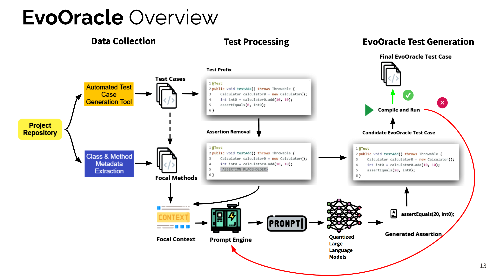

# Automated Oracle Generation Tool using Large Language Models
This repository contains an automated Oracle generation tool that leverages the power of Large Language Models (LLMs) to enhance software testing efficiency. The tool is designed to generate JUnit tests and test case assertions, acting as an Oracle for the system under test.

## Tool Architecture

*Figure 01: Tool Overview*

## Workflow
The tool follows the following workflow:

1. **JUnit Test Generation:** The system under test is input to EvoSuite, a test case generation tool that generates JUnit tests.
2. **Prompt Preparation:** Based on query strategies, a prompt is prepared from the code base of the system under test. This prompt is used to query the Large Language Model interface.
3. **LLM Interface:** The tool interfaces with multiple Large Language Models through an API. The prompt is sent to the LLM interface, which generates responses in the form of JUnit tests and oracles.
4. **Response Handling:** The generated JUnit tests and oracles are received from the LLM interface. The tool checks for any compilation errors in the received responses. If errors are detected, the LLM interface is prompted again for corrected responses.
5. **Test Execution and Comparison:** The generated tests are executed, and the tool compares the results with the tests generated by EvoSuite.

# Startup
1. Create a virtual environment `python -m venv evooracle_venv`
2. Activate it: 
   - Windows:`.\evooracle_venv\Scripts\activate`
   - Mac: `source evooracle_venv/bin/activate`
3. Download the required LLM models and take note of the PATH they're installed to
5. Clone this repo `git@github.com:khandakerrahin/evooracle.git`
6. Go into the directory `cd evooracle`
7. Install the required dependencies `pip install -r requirements.txt`
8. Update the base ggml download path of the models in line 17 of `app.py`, e.g. `BASE_PATH = 'C:/Users/User/AppData/Local/nomic.ai/GPT4All/'` and openAI api key on line 19
9. Run the tool:
	- To preprocess the test cases: `python run_test_case_list_gen.py`
	- To generate Oracles: `python run_evoOracle.py`

# Who, When, Why?
👨🏾‍💻 Author: Shaker Mahmud Khandaker  
📅 Version: 1.x 
📜 License: This project is licensed under the <a href="https://opensource.org/license/mit/"> MIT License
</a>  

